# BalanceX: Application Architecture Flow

This document details the live data flow, hybrid component interactions, and architectural layers of BalanceX.

```mermaid
flowchart TD
    %% Styling
    classDef default fill:#f9f9f9,stroke:#333,stroke-width:2px,color:#000
    classDef security fill:#fff3e0,stroke:#e65100,stroke-width:2px,color:#000
    classDef ui fill:#e3f2fd,stroke:#1565c0,stroke-width:2px,color:#000
    classDef compose fill:#ede7f6,stroke:#512da8,stroke-width:2px,color:#000
    classDef worker fill:#e0f2f1,stroke:#00695c,stroke-width:2px,color:#000
    classDef logic fill:#fce4ec,stroke:#c2185b,stroke-width:2px,color:#000
    classDef data fill:#e8f5e9,stroke:#2e7d32,stroke-width:2px,color:#000
    classDef user fill:#ffebee,stroke:#c62828,stroke-width:3px,color:#000

    %% User
    User(("👤 User")):::user

    subgraph Security_Gate ["🔒 Security & Vault Gate"]
        Auth{"BiometricPrompt (Fingerprint/PIN)"}:::security
        DrawerLock["Drawer Anti-Tamper Lock"]:::security
    end

    subgraph UI_Layer ["📱 UI & Presentation Layer"]
        direction TB
        MainActivity["MainActivity (Home Dashboard)"]:::ui
        EntryActivity["EntryActivity (Transaction Logging)"]:::ui
        SubscriptionsActivity["SubscriptionsActivity (Recurring)"]:::ui
        GoalsBudgetsActivity["GoalsBudgetsActivity (Budgets & Goals)"]:::ui
        ReportsActivity["ReportsActivity (Flow Analytics)"]:::ui
        SettingsActivity["SettingsActivity (Theme & Backup)"]:::ui
        
        subgraph Compose_Visualizations ["📊 Modern Compose Canvas Layer"]
            ChartBridge["ModernChartBridge"]:::compose
            PieBridge["ModernPieChartBridge"]:::compose
            ModernChart["ModernFinancialChart (Bézier / Scrubbing)"]:::compose
            ModernPie["ModernPieChart (Donut Breakdown)"]:::compose
        end
    end

    subgraph Background_Workers ["⚙️ Background Processing"]
        WorkManager["AndroidX WorkManager"]:::worker
        SubWorker["SubscriptionWorker (Daily Alarm)"]:::worker
        NotifManager["NotificationManager (POST_NOTIFICATIONS)"]:::worker
    end

    subgraph Business_Logic ["🧠 Domain & Business Logic"]
        direction TB
        HealthEngine["FinancialHealthEngine (0–100 Wellness Score)"]:::logic
        TxRepo["TransactionRepository"]:::logic
        SubRepo["SubscriptionRepository"]:::logic
        BudgetRepo["BudgetGoalRepository"]:::logic
        PDFGen["iText7 Statement Generator"]:::logic
    end

    subgraph Encrypted_Data_Layer ["💾 Encrypted Local Storage"]
        direction TB
        Exec["Shared Database Executor (4 Threads)"]:::data
        SQLCipher["SQLCipher AES-256 Engine"]:::data
        AppDB[("Room Database (v2, MIGRATION_1_2)")]:::data
        JSONBackup["JSON Ledger Backup & Restore"]:::data
    end

    %% Flow Connections
    User -- Opens App / Resumes --> Auth
    Auth -- Success --> MainActivity
    Auth -- Locked / Cancel --> DrawerLock
    
    MainActivity --> EntryActivity
    MainActivity --> SubscriptionsActivity
    MainActivity --> GoalsBudgetsActivity
    MainActivity --> ReportsActivity
    MainActivity --> SettingsActivity

    MainActivity <--> ChartBridge
    MainActivity <--> PieBridge
    ChartBridge --> ModernChart
    PieBridge --> ModernPie

    WorkManager --> SubWorker
    SubWorker --> NotifManager
    SubWorker -- Auto-Bill Insert --> TxRepo
    SubWorker -- Advance Due Date --> SubRepo

    MainActivity <--> HealthEngine
    GoalsBudgetsActivity <--> BudgetRepo
    SubscriptionsActivity <--> SubRepo
    ReportsActivity <--> TxRepo
    SettingsActivity <--> JSONBackup
    ReportsActivity --> PDFGen

    HealthEngine <--> TxRepo
    HealthEngine <--> BudgetRepo
    HealthEngine <--> SubRepo

    TxRepo <--> Exec
    SubRepo <--> Exec
    BudgetRepo <--> Exec

    Exec <--> SQLCipher
    SQLCipher <--> AppDB
```

---

## Architectural Breakdown

### 1. Security & Vault Gate
- **Biometric Authentication**: Enforced on cold launch and when resuming from background via `onStop()` invalidation.
- **Anti-Tamper Lock**: When the security overlay is active, `DrawerLayout` locks closed (`LOCK_MODE_LOCKED_CLOSED`) to prevent drawer gesture bypasses and protect JSON export actions.

### 2. Hybrid UI & Jetpack Compose Bridge
- **Native XML Scaffolding**: Activities use Material 3 XML layouts with edge-to-edge support.
- **Bridge Controllers**: `ModernChartBridge` and `ModernPieChartBridge` expose Java-friendly APIs that manage Compose state within embedded `ComposeView` containers.
- **Interactive Visualizations**: `ModernFinancialChart` supports Bézier curve interpolation, gradient fills, and touch scrubbing for daily, weekly, monthly, and yearly intervals. Defaulted to the **Line Chart** with the **Months** filter on the home tab.

### 3. Background Services & WorkManager
- `SubscriptionWorker` runs once every 24 hours.
- Computes upcoming due dates and triggers local reminder notifications (`POST_NOTIFICATIONS` runtime permission compliant).
- Auto-bills active subscriptions on their due date with catch-up deduplication.

### 4. Domain & Health Engine Layer
- `FinancialHealthEngine` continuously recalculates financial wellness across 3 metrics:
  1. **Savings Rate (40 pts)**: Ratio of monthly net credit to debit.
  2. **Budget Adherence (35 pts)**: Ratio of categories operating within monthly limits.
  3. **Commitment Ratio (25 pts)**: Proportion of cashflow absorbed by recurring bills.
- Emits a dedicated `NO_DATA` state on empty ledgers to maintain trust.

### 5. Data Persistence & Encryption
- **Database**: Room Database with SQLCipher (`balancex_encrypted_database.db`) utilizing 256-bit AES encryption.
- **Migration**: Non-destructive `MIGRATION_1_2` preserves user subscriptions and goals across schema updates.
- **Concurrency**: Operations run on `AppDatabase.databaseWriteExecutor` to prevent thread leaks and race conditions.
